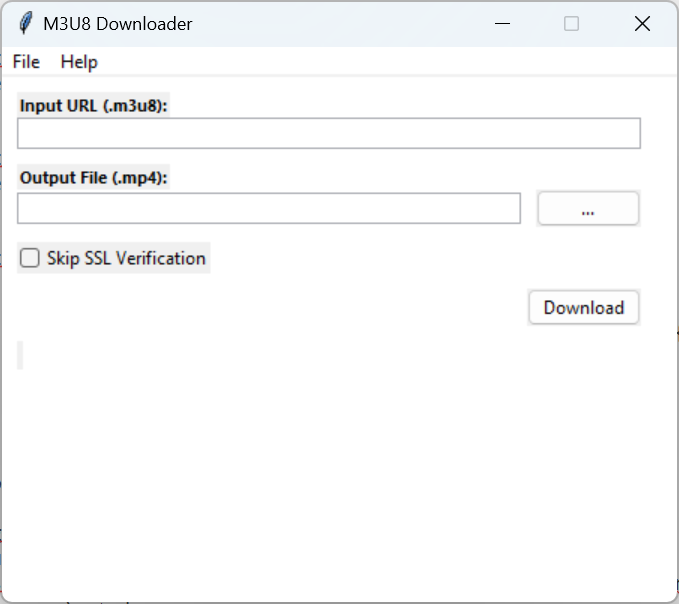
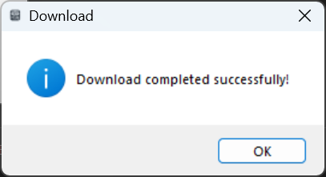

# M3U8 Downloader

M3U8 Downloader UI is a Python-based graphical user interface (GUI) application designed to simplify the process of
downloading and concatenating video files using the [pym3u8downloader](https://github.com/coldsofttech/pym3u8downloader)
package.
This application streamlines the task of downloading and merging video files from M3U8 playlists.

## Supported Operating Systems

The M3U8 Downloader UI is compatible with the following operating systems:

- Windows
- RHEL (Red Hat Enterprise Linux)
- SLES (SUSE Enterprise Linux Server)
- Ubuntu

Please note that at this time, the application exclusively supports the aforementioned operating systems.

## Packages

For the latest release and executable packages for various operating systems, please refer to the `Releases` section.

# Guide

Refer below for comprehensive instructions on how to use the application and common troubleshooting scenarios.

**Important Notes:**

- Internet connectivity is required for various operations such as startup and downloading video files from M3U8
  playlists.
- Ensure your system has at least twice the size of the video file available for download and output video preparation.
  The required space depends on the size of the video file specified in the input .m3u8 playlist. The application checks
  for available space and warns if it's insufficient.
- Exiting the application during a download is not possible.

**Additional Information:**

- The following steps are demonstrated using the Windows executable. Procedures are similar for other supported
  operating systems, except for how to launch the application.
- For detailed user guidance, navigate to **Help > Help** within the application (this document).
- Find additional information, including licensing details, under **Help > About**.

**Step 1:** Launch **M3U8 Downloader** UI by either right-clicking and selecting 'Open' or double-clicking the
executable.

**Step 2:** Enter the URL of the .m3u8 playlist file you wish to download into the **Input URL (.m3u8)** field.
**Step 3:** Specify the destination folder for the downloaded file by clicking the **...** button.

**Step 4:** Once both the input URL and output file are specified, click the **Download** button.
**Step 5:** Track the download progress within the application.

**Step 6:** Upon successful completion of the download, a confirmation message will be displayed.

**Step 8:** To initiate a new download and reset the controls, go to **File > New**. This action resets the controls and
allows you to input a new URL and select a new output file.

## General Issues & Resolutions

### Invalid Input URL

The above message appears when the provided input URL is not a valid .m3u8 playlist file. Ensure that the URL ends with
the _'.m3u8'_ file format.

### Download In Progress

This warning appears when attempting to exit the application while a download is in progress. You cannot exit the
application during an ongoing download.

# Limitations

For more information, refer to the limitations
of [pym3u8downloader](https://github.com/coldsofttech/pym3u8downloader/blob/main/README.md).
